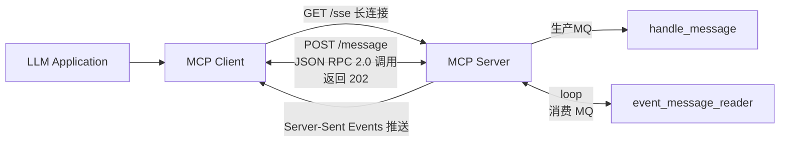

# MCP Server From 0 to 1

在继续我们关于 MCP 的 Dify 插件分享的过程中，本文将引导你了解如何在不使用 MCP 官方 Python SDK 的情况下，从零开始构建一个符合 MCP 协议的服务端（Server）。我们将详细介绍每一步骤，帮助你在完全手动的情况下实现一个满足 MCP 标准的完整解决方案。

## JSON-RPC

首先，我们需要了解的是，MCP 的消息体遵循 JSON-RPC 协议规范。关于该协议的详细说明，可以参考其官方文档：[JSON-RPC 2.0 Specification](https://www.jsonrpc.org/specification)。

第一步定义RPC的请求和响应实体，

```python
from pydantic import BaseModel
# {
#   jsonrpc: "2.0",
#   id: number | string,
#   method: string,
#   params?: object
# }
class MCPRequest(BaseModel):
    id: Optional[int | str] = None
    jsonrpc: str = "2.0"
    method: str
    params: Optional[dict] = None


# 定义一个响应模型
# {
#   jsonrpc: "2.0",
#   id: number | string,
#   result?: object,
#   error?: {
#     code: number,
#     message: string,
#     data?: unknown
#   }
# }
class MCPResponse(BaseModel):
    id: Optional[int | str] = None
    jsonrpc: str = "2.0"
    result: Optional[dict] = None
    error: Optional[Dict[str, Any]] = None
```

##  SSE/message 端点的实现

在上一篇文章中我们已经分析过，SSE（Server-Sent Events）端点的作用在于建立服务端与客户端之间的长连接。通过服务端主动推送事件消息的方式，客户端能够以流式的形式实时更新内容。相较之下，`message` 端点则主要用于处理客户端发起的各类 POST 请求，例如 `initialize`、`tools/list` 等方法的调用。

整个流程是这样的：客户端首先通过 `message` 接口发送请求，服务端接收并执行相应的操作；如果该操作耗时较长（如使用 MCP 协议下载一个大文件），服务端便可通过 SSE 通道异步地将任务进度持续推送给客户端。这种方式使得 LLM 能够及时感知到 MCP 的执行状态，并最终将相关信息反馈给用户。

通过结合 `message` 和 `SSE` 两种机制，系统不仅提升了交互的响应性和灵活性，也显著优化了用户体验，特别是在处理长时间任务时表现尤为突出。

```python
@app.get("/sse")
async def sse():
    """SSE连接端点"""
    mcp_server = MCPServer(tools=[get_current_weather])
    await mcp_server.event_queue.put(
        {"event": "endpoint", "data": f"/message?client_id={mcp_server.client_id}"}
    )
    return EventSourceResponse(
        mcp_server.event_message_reader(), ping=60  # 增加ping参数保持连接活跃
    )

@app.post("/message")
async def message(request: Request, mcpRequest: MCPRequest):
    """MCP消息处理端点"""
    print(f"Received request: {request} mcpRequest: {mcpRequest.model_dump_json()}")
    client_id = request.query_params.get("client_id")
    if client_id is None or client_id not in mcp_server_list:
        return MCPResponse(
            id=mcpRequest.id,
            jsonrpc="2.0",
            error={"code": -32600, "message": "Client ID not found or invalid"},
        ).model_dump_json(exclude_none=True)

    try:
        await mcp_server_list[client_id].handle_message(mcpRequest)
        return Response(status_code=202)
    except Exception as e:
        print(f"Error handling message: {e}")
        return MCPResponse(
            id=mcpRequest.id,
            jsonrpc="2.0",
            error={"code": -32600, "message": f"Internal error: {str(e)}"},
        ).model_dump_json(exclude_none=True)
```

SSE（Server-Sent Events）是一个基于 GET 方法的接口。在客户端首次初始化时，服务端会通过 SSE 连接返回一个包含客户端标识信息的消息，其中包括对应的 `message` 端点地址。这样，MCP 客户端就能在后续发起 POST 请求时，准确地知道应向哪个端点发送 RPC 方法调用。

`message` 接口则是一个 POST 方法，主要用于处理客户端的 RPC 请求。在这个接口中，我额外加入了一个客户端身份验证机制：如果请求中携带的客户端 ID 并不在服务端维护的已注册客户端列表中，服务端将返回一个异常响应，以确保只有经过认证的客户端才能继续执行后续操作。

## MCP Server 的实现

先看代码：

```python
# 存储活跃的MCP服务器实例
mcp_server_list: Dict[str, "MCPServer"] = {}

class MCPServer:
    def __init__(self, tools, server_name="xunberg", server_version="0.0.1"):
        self.event_queue = asyncio.Queue()  # 用于存储事件消息
        self.client_id = str(uuid.uuid4())
        self.server_info = {
            "protocolVersion": "2024-11-05",
            "capabilities": {
                "experimental": {},
                "prompts": {"listChanged": False},
                "resources": {"subscribe": False, "listChanged": False},
                "tools": {"listChanged": False},
            },
            "serverInfo": {"name": server_name, "version": server_version},
        }
        self.tools = tools
        mcp_server_list[self.client_id] = self

    async def event_message_reader(self):
        """事件消息读取器，用于SSE连接"""
        try:
            while True:
                event_message = await self.event_queue.get()
                print(f"event_message: {event_message}")
                yield event_message
                self.event_queue.task_done()
        except asyncio.CancelledError:
            print(f"Client {self.client_id} disconnected")
            # 清理资源
            if self.client_id in mcp_server_list:
                del mcp_server_list[self.client_id]

    async def handle_message(self, request: MCPRequest):
        """处理接收到的MCP请求"""
        method = request.method
        handlers = {
            "initialize": self._handle_initialize,
            "notifications/initialized": lambda req: MCPResponse(
                id=req.id, result={}
            ),  # 处理初始化完成通知
            "tools/list": self._handle_tools_list,
            "tools/call": self._handle_tools_call,
            "resources/list": self._handle_resources_list,
            "prompts/list": self._handle_prompts_list,
        }

        handler = handlers.get(method)
        if handler:
            mcpResponse = handler(request)
            response = mcpResponse.model_dump_json(exclude_none=True)
            await self.event_queue.put({"event": "message", "data": response})
        else:
            # 处理未知方法
            error_response = MCPResponse(
                id=request.id,
                error={"code": -32601, "message": f"Method '{method}' not found"},
            ).model_dump_json(exclude_none=True)
            await self.event_queue.put({"event": "message", "data": error_response})

    def _handle_initialize(self, request: MCPRequest) -> MCPResponse:
        """处理初始化请求"""
        return MCPResponse(id=request.id, result=self.server_info)

    def _handle_tools_list(self, request: MCPRequest) -> MCPResponse:
        """处理工具列表请求"""
        mcp_tools = []
        for tool in self.tools:
            mcp_tools.append(
                {
                    "name": tool.__name__,
                    "description": tool.__doc__,
                    "inputSchema": {
                        "type": "object",
                        "properties": {
                            param.name: {
                                "type": "string",
                                "description": param.annotation.__doc__,
                            }
                            for param in inspect.signature(tool).parameters.values()
                        },
                    },
                }
            )
        return MCPResponse(id=request.id, result={"tools": mcp_tools})

    def _handle_tools_call(self, request: MCPRequest) -> MCPResponse:
        """处理工具调用请求"""
        tool_name = request.params.get("name")
        arguments = request.params.get("arguments", {})
        final_result = {
            "type": "text",
        }
        try:
            for tool in self.tools:
                if tool.__name__ == tool_name:
                    tool_result = tool(**arguments)
                    final_result["text"] = str(tool_result)
                    return MCPResponse(
                        id=request.id, result={"content": [final_result]}
                    )
        except Exception as e:
            final_result["text"] = str(f"Error executing tool {tool_name}: {str(e)}")
            return MCPResponse(
                id=request.id, result={"content": [final_result], "isError": True}
            )

    def _handle_resources_list(self, request: MCPRequest) -> MCPResponse:
        """处理资源列表请求"""
        return MCPResponse(id=request.id, result={"resources": []})

    def _handle_prompts_list(self, request: MCPRequest) -> MCPResponse:
        """处理提示列表请求"""
        return MCPResponse(id=request.id, result={"prompts": []})
```

核心逻辑可以从 `handle_message` 方法开始理解。当客户端携带某个 RPC `method` 请求到达服务端时，系统会进入 `handle_message` 方法进行处理。该方法根据请求中的 `method` 名称匹配对应的处理器（Handler），执行相应的业务逻辑，并将结果封装后写入 `event_queue`。

`event_queue` 本质上是一个消息队列（MQ）的模拟实现，负责在 `handle_message` 中“生产”事件数据，并由 `event_message_reader` 方法进行“消费”。这个 `event_message_reader` 是在 SSE 的 GET 接口（即事件流接口）中被调用的，通过 `EventSourceResponse` 持续地将事件流推送给客户端。

为了保持事件的持续推送，`event_message_reader` 内部采用了一个 `while True` 循环，不断从 `event_queue` 中读取新事件，确保客户端能够实时接收到最新的异步处理结果。

通过这种设计，我们实现了 MCP 协议中“命令-响应”的异步化流程：

*   `message` 端点负责接收并执行操作
    
*   `SSE` 端点负责将执行结果以事件流的形式异步推送回客户端
    

此外，我们还维护了一个 `mcp_server_list`，用于存储已连接的 MCP 客户端实例。每个客户端通过唯一的 `client_id` 进行标识，从而实现不同客户端之间的事件队列隔离，确保每个客户端只接收到属于自己的事件流。

## 图解

最后画个图来让我们更清楚的去理解整个过程



完整的代码地址：

```python
import asyncio
import uuid
import uvicorn
import json
import inspect
from pydantic import BaseModel
from typing import Optional, Dict, List, Any
from fastapi import FastAPI, Request, Response, HTTPException
from sse_starlette.sse import EventSourceResponse


# 定义一个请求模型
# {
#   jsonrpc: "2.0",
#   id: number | string,
#   method: string,
#   params?: object
# }
class MCPRequest(BaseModel):
    id: Optional[int | str] = None
    jsonrpc: str = "2.0"
    method: str
    params: Optional[dict] = None


# 定义一个响应模型
# {
#   jsonrpc: "2.0",
#   id: number | string,
#   result?: object,
#   error?: {
#     code: number,
#     message: string,
#     data?: unknown
#   }
# }
class MCPResponse(BaseModel):
    id: Optional[int | str] = None
    jsonrpc: str = "2.0"
    result: Optional[dict] = None
    error: Optional[Dict[str, Any]] = None


app = FastAPI()

# 存储活跃的MCP服务器实例
mcp_server_list: Dict[str, "MCPServer"] = {}

def get_current_weather(location: str):
    """获取当前天气信息
    Args:
        location (str): 城市，例如：苏州，上海
    Returns:
        dict: 包含天气信息的字典
    """
    return {
        "location": location,
        "temperature": "20°C",
        "forecast": "Sunny",
    }


class MCPServer:
    def __init__(self, tools, server_name="xunberg", server_version="0.0.1"):
        self.event_queue = asyncio.Queue()  # 用于存储事件消息
        self.client_id = str(uuid.uuid4())
        self.server_info = {
            "protocolVersion": "2024-11-05",
            "capabilities": {
                "experimental": {},
                "prompts": {"listChanged": False},
                "resources": {"subscribe": False, "listChanged": False},
                "tools": {"listChanged": False},
            },
            "serverInfo": {"name": server_name, "version": server_version},
        }
        self.tools = tools
        mcp_server_list[self.client_id] = self

    async def event_message_reader(self):
        """事件消息读取器，用于SSE连接"""
        try:
            while True:
                event_message = await self.event_queue.get()
                print(f"event_message: {event_message}")
                yield event_message
                self.event_queue.task_done()
        except asyncio.CancelledError:
            print(f"Client {self.client_id} disconnected")
            # 清理资源
            if self.client_id in mcp_server_list:
                del mcp_server_list[self.client_id]

    async def handle_message(self, request: MCPRequest):
        """处理接收到的MCP请求"""
        method = request.method
        handlers = {
            "initialize": self._handle_initialize,
            "notifications/initialized": lambda req: MCPResponse(
                id=req.id, result={}
            ),  # 处理初始化完成通知
            "tools/list": self._handle_tools_list,
            "tools/call": self._handle_tools_call,
            "resources/list": self._handle_resources_list,
            "prompts/list": self._handle_prompts_list,
        }

        handler = handlers.get(method)
        if handler:
            mcpResponse = handler(request)
            response = mcpResponse.model_dump_json(exclude_none=True)
            await self.event_queue.put({"event": "message", "data": response})
        else:
            # 处理未知方法
            error_response = MCPResponse(
                id=request.id,
                error={"code": -32601, "message": f"Method '{method}' not found"},
            ).model_dump_json(exclude_none=True)
            await self.event_queue.put({"event": "message", "data": error_response})

    def _handle_initialize(self, request: MCPRequest) -> MCPResponse:
        """处理初始化请求"""
        return MCPResponse(id=request.id, result=self.server_info)

    def _handle_tools_list(self, request: MCPRequest) -> MCPResponse:
        """处理工具列表请求"""
        mcp_tools = []
        for tool in self.tools:
            mcp_tools.append(
                {
                    "name": tool.__name__,
                    "description": tool.__doc__,
                    "inputSchema": {
                        "type": "object",
                        "properties": {
                            param.name: {
                                "type": "string",
                                "description": param.annotation.__doc__,
                            }
                            for param in inspect.signature(tool).parameters.values()
                        },
                    },
                }
            )
        return MCPResponse(id=request.id, result={"tools": mcp_tools})

    def _handle_tools_call(self, request: MCPRequest) -> MCPResponse:
        """处理工具调用请求"""
        tool_name = request.params.get("name")
        arguments = request.params.get("arguments", {})
        final_result = {
            "type": "text",
        }
        try:
            for tool in self.tools:
                if tool.__name__ == tool_name:
                    tool_result = tool(**arguments)
                    final_result["text"] = str(tool_result)
                    return MCPResponse(
                        id=request.id, result={"content": [final_result]}
                    )
        except Exception as e:
            final_result["text"] = str(f"Error executing tool {tool_name}: {str(e)}")
            return MCPResponse(
                id=request.id, result={"content": [final_result], "isError": True}
            )

    def _handle_resources_list(self, request: MCPRequest) -> MCPResponse:
        """处理资源列表请求"""
        return MCPResponse(id=request.id, result={"resources": []})

    def _handle_prompts_list(self, request: MCPRequest) -> MCPResponse:
        """处理提示列表请求"""
        return MCPResponse(id=request.id, result={"prompts": []})


@app.get("/sse")
async def sse():
    """SSE连接端点"""
    mcp_server = MCPServer(tools=[get_current_weather])
    await mcp_server.event_queue.put(
        {"event": "endpoint", "data": f"/message?client_id={mcp_server.client_id}"}
    )
    return EventSourceResponse(
        mcp_server.event_message_reader(), ping=60  # 增加ping参数保持连接活跃
    )


@app.post("/message")
async def message(request: Request, mcpRequest: MCPRequest):
    """MCP消息处理端点"""
    print(f"Received request: {request} mcpRequest: {mcpRequest.model_dump_json()}")
    client_id = request.query_params.get("client_id")
    if client_id is None or client_id not in mcp_server_list:
        return MCPResponse(
            id=mcpRequest.id,
            jsonrpc="2.0",
            error={"code": -32600, "message": "Client ID not found or invalid"},
        ).model_dump_json(exclude_none=True)

    try:
        await mcp_server_list[client_id].handle_message(mcpRequest)
        return Response(status_code=202)
    except Exception as e:
        print(f"Error handling message: {e}")
        return MCPResponse(
            id=mcpRequest.id,
            jsonrpc="2.0",
            error={"code": -32600, "message": f"Internal error: {str(e)}"},
        ).model_dump_json(exclude_none=True)


if __name__ == "__main__":
    uvicorn.run(app, host="0.0.0.0", port=8009)

```